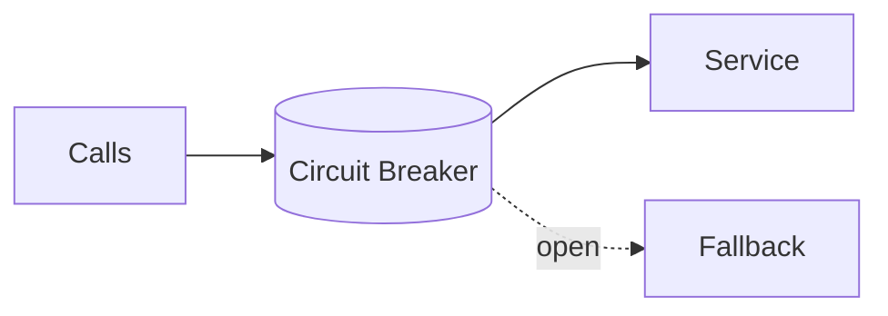

# Circuit Breaker

## 0) Metadata
- **Name**: Circuit Breaker
- **Canonical Path**: Patterns/005_ResiliencePatterns/Circuit_Breaker.md
- **Category**: 005 Resilience Patterns
- **Status**: Stable
- **Last Updated**: YYYY-MM-DD
- **Tags**: circuit, failure-rate, half-open, fallback

---

## 1) TL;DR (Executive Summary)
- **Problem**: Persistently failing dependencies waste resources and increase latency.
- **Solution (essence)**: Detect failures and "open" the circuit to fail fast; periodically probe (half-open) to recover.

---

## 2) States
- Closed: pass-through; count failures.
- Open: reject immediately (fast-fail, fallback).
- Half-open: allow limited probes; close on success or re-open on failure.

## 3) Architecture

---

## 4) Properties & Tradeoffs
| Aspect | Pros | Cons | Notes |
|---|---|---|---|
| Latency | Fast-fail | Potential false opens | Tune thresholds |
| Stability | Protects system | Fallback complexity | Graceful degradation |

---

## 5) Implementation Guide
- Error window: sliding window over N calls or T seconds; failure rate/latency thresholds.
- Half-open: limited concurrency; jittered probes.
- Fallbacks: cached/stale data, default values, graceful messaging.
- Combine with timeouts, retries (budgeted), and bulkheads.

---

## 6) Pitfalls & Edge Cases
- Shared breaker across disparate paths; isolate by dependency/endpoint.
- Retry storms during half-open; limit probes.
- Silent degradation; expose health in responses/headers.

---

## 7) Observability
- Metrics: open ratio, probe success, fallback rate, dependency latency/error.
- Alerts: high open rate for critical dependencies.

---

## 8) References
- Nygard "Release It!"; resilience libraries (Hystrix, Resilience4j); service mesh circuit breaking.
