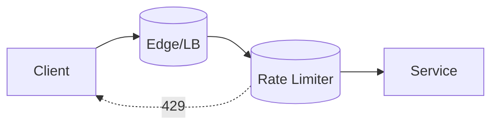

# Rate Limiting

## 0) Metadata
- **Name**: Rate Limiting
- **Canonical Path**: Patterns/005_ResiliencePatterns/Rate_Limiting.md
- **Category**: 005 Resilience Patterns
- **Status**: Stable
- **Last Updated**: YYYY-MM-DD
- **Tags**: rate-limit, token-bucket, leaky-bucket, quotas, abuse-prevention

---

## 1) TL;DR (Executive Summary)
- **Problem**: Uncontrolled traffic spikes and abusive clients harm availability and fairness.
- **Solution (essence)**: Enforce limits per principal (IP/user/key) using token/leaky buckets and quotas.

---

## 2) Algorithms
- Token Bucket: tokens refill at rate R; burst capacity B.
- Leaky Bucket: fixed drain rate; smooths bursts.
- Fixed Window / Sliding Window: simpler reporting; sliding reduces boundary effects.

## 3) Architecture

---

## 4) Properties & Tradeoffs
| Aspect | Pros | Cons | Notes |
|---|---|---|---|
| Protection | Preserves SLOs | Rejections | Clear docs/errors |
| Fairness | Per-principal quotas | Global coordination cost | Hierarchical limits |
| Scale | Stateless calc + shared store | Hot keys | Shard keys; prefix spread |

---

## 5) Implementation Guide
- Define principals and limits per API/tier; document 429 handling.
- Use fast in-memory counters + durable store for distributed accuracy.
- Headers: `X-RateLimit-*` to communicate limits/remaining/reset.
- Combine with quotas and burst policies.

---

## 6) Pitfalls & Edge Cases
- Clock skew across nodes; prefer server-side timestamps.
- Hot keys for popular tenants; shard and add jitter to refill.
- Distributed counters’ contention; use approximate counters/sketches if needed.

---

## 7) Observability
- Metrics: 429 rates per principal/API, token bucket occupancy, latency.
- Alerts: spikes in 429 for critical APIs; limiter latency.

---

## 8) References
- IETF rate-limit headers draft; API gateway docs; SRE on overload protection.
