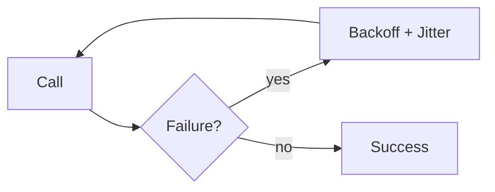

# Retry with Exponential Backoff (and Jitter)

## 0) Metadata
- **Name**: Retry with Backoff
- **Canonical Path**: Patterns/005_ResiliencePatterns/Retry_with_Backoff.md
- **Category**: 005 Resilience Patterns
- **Status**: Stable
- **Last Updated**: YYYY-MM-DD
- **Tags**: retry, backoff, jitter, budgets, idempotency

---

## 1) TL;DR (Executive Summary)
- **Problem**: Transient failures and timeouts are common; naive retries amplify load and cause storms.
- **Solution (essence)**: Retry idempotent operations with exponential backoff and jitter, bounded by budgets.

---

## 2) Concepts
- Exponential backoff: delay = base * 2^attempt.
- Jitter: randomize delay to avoid synchronization.
- Retry budget: cap total retry traffic (e.g., 10% of successful RPS).
- Idempotency: ensure safe re-execution.

## 3) Flow

---

## 4) Properties & Tradeoffs
| Aspect | Pros | Cons | Notes |
|---|---|---|---|
| Stability | Smooths bursts | Added latency | Budget, caps |
| Success | Recovers transient errors | Wastes work on permanent errors | Fail fast on 4xx |

---

## 5) Implementation Guide
- Retries only for idempotent requests and retriable errors (timeouts, 5xx).
- Policy: max attempts, base/backoff factor, jitter, per-try timeout.
- Hedged requests (optional) for tail-latency with care.
- Combine with circuit breakers and bulkheads.

---

## 6) Pitfalls & Edge Cases
- Retrying non-idempotent ops causes duplicates; require idempotency keys.
- Coordinated retries without jitter cause thundering herds.
- Unbounded retries overwhelm systems; enforce budgets and caps.

---

## 7) Observability
- Metrics: retry attempts, success-after-retry rate, added latency, budget usage.
- Alerts: surge in retries and error codes.

---

## 8) References
- Google SRE books on backoff and jitter; AWS architecture blogs.
