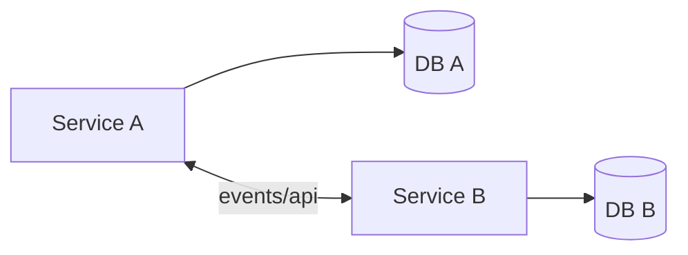

# Database per Service

## 0) Metadata
- **Name**: Database per Service
- **Canonical Path**: Patterns/006_ScalabilityPatterns/Database_per_Service.md
- **Category**: 006 Scalability Patterns
- **Status**: Stable
- **Last Updated**: YYYY-MM-DD
- **Tags**: microservices, isolation, scaling, autonomy

---

## 1) TL;DR (Executive Summary)
- **Problem**: Shared databases couple services, create contention, and block independent scaling.
- **Solution (essence)**: Each service owns its database schema/storage; communicate via APIs/events.

---

## 2) Architecture

---

## 3) Properties & Tradeoffs
| Aspect | Pros | Cons | Notes |
|---|---|---|---|
| Isolation | Fewer cross-team conflicts | Data duplication | Async sync |
| Scaling | Independent | Distributed transactions | Sagas/outbox |
| Autonomy | Faster changes | Reporting complexity | Data lake/CDC |

---

## 4) Implementation Guide
- Enforce ownership boundaries; no cross-service DB access.
- Use event streams/CDC for data sharing; maintain projections.
- Provide APIs for required data; avoid chatty calls.

---

## 5) Pitfalls & Edge Cases
- Joins across services; use precomputed projections.
- Data drift; schema registry and compatibility.

---

## 6) References
- Microservices patterns; DDIA on data integration.
