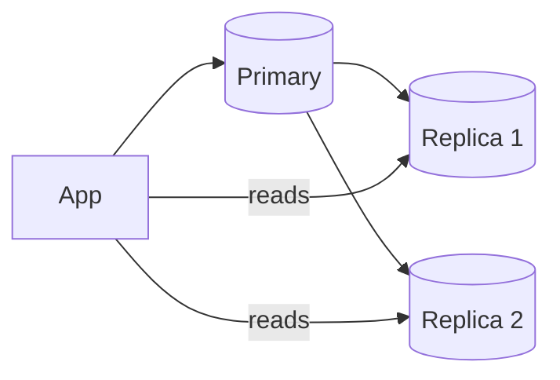

# Read Replicas

## 0) Metadata
- **Name**: Read Replicas
- **Canonical Path**: Patterns/006_ScalabilityPatterns/Read_Replicas.md
- **Category**: 006 Scalability Patterns
- **Status**: Stable
- **Last Updated**: YYYY-MM-DD
- **Tags**: replicas, readonly, lag, read-scaling

---

## 1) TL;DR (Executive Summary)
- **Problem**: Primary database can’t serve growing read traffic.
- **Solution (essence)**: Add replicas for read-only queries; route non-critical reads to them.

---

## 2) Architecture

---

## 3) Properties & Tradeoffs
| Aspect | Pros | Cons | Notes |
|---|---|---|---|
| Scale | Offload reads | Stale reads | Not read-your-writes |
| Availability | Failover targets | Complexity | Reader endpoints |
| Cost | Cheaper than sharding | Ops overhead | Auto-provision |

---

## 4) Implementation Guide
- Routing: split read/write paths; session stickiness for read-your-writes.
- Lag-aware: route fresh reads to primary; expose consistency hints.
- Backups from replicas to offload primary; monitor lag.

---

## 5) Pitfalls & Edge Cases
- Read-after-write anomalies; stale caches.
- Replication lag spikes during maintenance.

---

## 6) Observability
- Metrics: replication lag, read QPS/latency per node, error rates.
- Alerts: lag > threshold; replica down.

---

## 7) References
- Vendor docs (Postgres/MySQL) on replicas.
