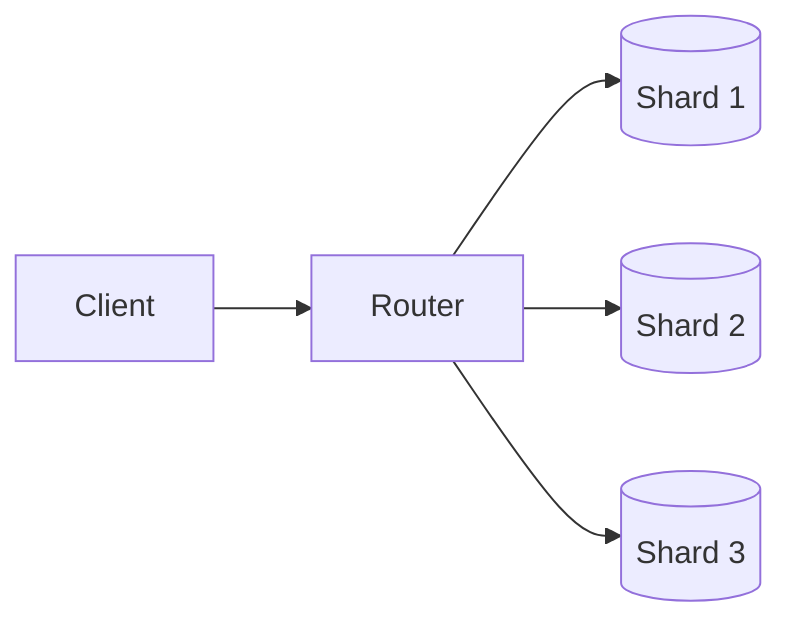

# Sharding

## 0) Metadata
- **Name**: Sharding
- **Canonical Path**: Patterns/006_ScalabilityPatterns/Sharding.md
- **Category**: 006 Scalability Patterns
- **Status**: Stable
- **Last Updated**: YYYY-MM-DD
- **Tags**: partitioning, sharding, routing, resharding

---

## 1) TL;DR (Executive Summary)
- **Problem**: Single-node limits for data/throughput.
- **Solution (essence)**: Split data across shards and route requests by key.
- See canonical: `Patterns/007_DatabasePatterns/Sharding.md` for deep database-specific guidance.

---

## 2) Architecture (High-Level)

---

## 3) Notes
- Choose keys to avoid hotspots; support resharding with consistent hashing/virtual nodes.
- Coordinate with caches and search indexes.

---

## 4) References
- See Database Patterns: Sharding; DDIA partitioning chapters; Vitess/Citus docs.
