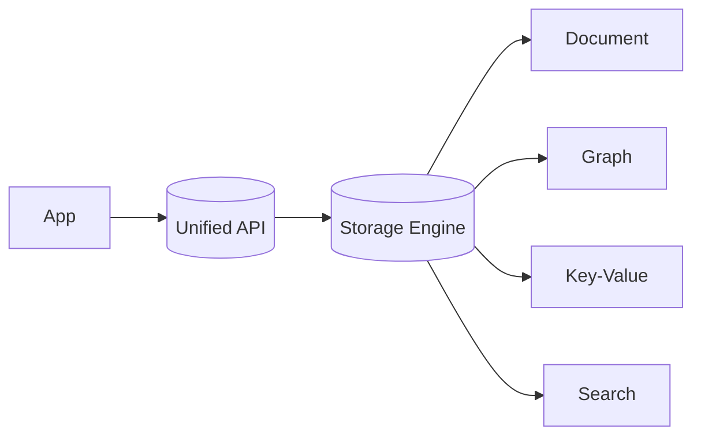

# Multi-Model Databases

## 0) Metadata
- **Name**: Multi-Model Databases
- **Canonical Path**: Patterns/007_DatabasePatterns/Multi_Model.md
- **Category**: 007 Database Patterns
- **Status**: Stable
- **Last Updated**: YYYY-MM-DD
- **Tags**: multi-model, document, graph, key-value, search

---

## 1) TL;DR (Executive Summary)
- **Problem**: Applications need multiple data models (docs, graph, KV) and want fewer moving parts.
- **Solution (essence)**: Use a single database engine that supports multiple models behind one storage/transaction layer.
- **Use when**: Mixed workloads benefit from shared transactions/operations and operational simplicity.
- **Key tradeoff**: Feature breadth vs depth/performance of best-in-class single-model systems.

---

## 2) Models Supported
- Document (JSON/BSON), Key-Value, Graph (property graph), Column-family, Search indices.
- Shared query layer or per-model APIs; optional cross-model joins.

## 3) Architecture

---

## 4) Properties & Tradeoffs
| Aspect | Pros | Cons | Notes |
|---|---|---|---|
| Ops | Fewer systems | Vendor lock-in | Simpler platform |
| Consistency | Shared TXs possible | Cross-model limits | Check isolation guarantees |
| Performance | Good enough | Not best-in-class | Benchmark critical paths |

---

## 5) Implementation Guide
- Start with primary access pattern; validate each model’s indexing.
- Avoid cross-model anti-patterns that degrade performance.
- Backup/restore and consistency across models must be tested.

---

## 6) Pitfalls & Edge Cases
- Hot documents/vertices; partitioning still required.
- Query planner surprises across models; use explicit indexes/hints.

---

## 7) Observability
- Metrics by model: QPS, latency, index hit rates, storage usage per model.

---

## 8) References
- ArangoDB, Cosmos DB multi-model docs; DDIA discussions on data models.
