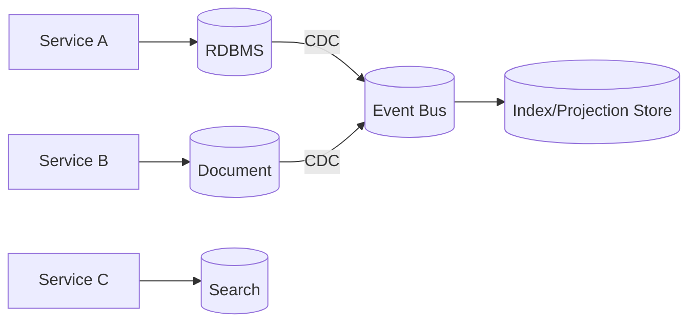

# Polyglot Persistence

## 0) Metadata
- **Name**: Polyglot Persistence
- **Canonical Path**: Patterns/007_DatabasePatterns/Polyglot_Persistence.md
- **Category**: 007 Database Patterns
- **Status**: Stable
- **Last Updated**: YYYY-MM-DD
- **Tags**: polyglot, multiple-datastores, integration, cdc

---

## 1) TL;DR (Executive Summary)
- **Problem**: One database type rarely fits all use cases.
- **Solution (essence)**: Use multiple specialized datastores per workload, integrating via events/CDC/search.
- **Use when**: Different services/components have distinct access patterns and SLOs.
- **Key tradeoff**: Operational complexity vs optimal performance/fit.

---

## 2) Architecture

---

## 3) Properties & Tradeoffs
| Aspect | Pros | Cons | Notes |
|---|---|---|---|
| Fit | Best tool per job | More systems to manage | Platform investment |
| Consistency | Clear boundaries | Eventual across stores | Outbox/CDC |
| Scale | Independent | Data integration | Data lake/search layer |

---

## 4) Implementation Guide
- Ownership per service; avoid cross-store joins.
- Share data via events/CDC; maintain projections and search indexes.
- Global reporting via data lake/warehouse.

---

## 5) Pitfalls & Edge Cases
- Data drift; schema registry; compatibility policies.
- Backfills and replays; idempotent projections.

---

## 6) References
- DDIA; microservices data patterns; Debezium/CDC docs.
