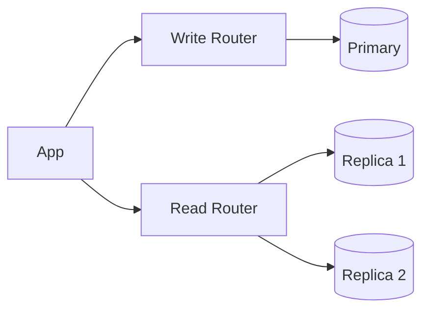

# Read-Write Separation

## 0) Metadata
- **Name**: Read-Write Separation
- **Canonical Path**: Patterns/007_DatabasePatterns/Read_Write_Separation.md
- **Category**: 007 Database Patterns
- **Status**: Stable
- **Last Updated**: YYYY-MM-DD
- **Tags**: primary-replica, read-write-split, consistency

---

## 1) TL;DR (Executive Summary)
- **Problem**: Mixed read and write workloads overload a single endpoint.
- **Solution (essence)**: Route writes to primary and reads to replicas or read endpoints, with consistency-aware routing.

---

## 2) Architecture

---

## 3) Properties & Tradeoffs
| Aspect | Pros | Cons | Notes |
|---|---|---|---|
| Scale | Split load | Stale reads | Session stickiness |
| Simplicity | Clear separation | More routing logic | Libraries/proxies |

---

## 4) Implementation Guide
- Library/proxy-based split; fallback to primary for read-after-write.
- Tag requests with consistency needs; expose freshness tokens.
- Monitor lag to steer critical reads.

---

## 5) Pitfalls & Edge Cases
- Complex transactions that mix read and write; keep on primary.
- Read-your-writes requirements; use tokens or primary reads.

---

## 6) References
- Vendor docs and proxies (PgBouncer/ProxySQL), application frameworks.
