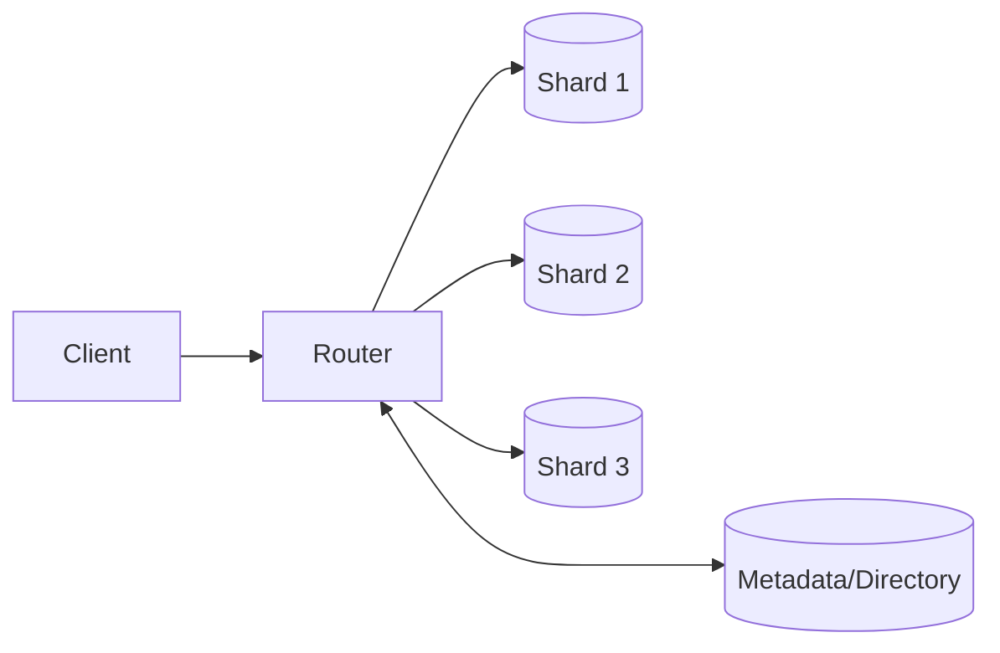

# Sharding (Canonical)

## 0) Metadata
- **Name**: Sharding
- **Canonical Path**: Patterns/007_DatabasePatterns/Sharding.md
- **Category**: 007 Database Patterns
- **Status**: Stable
- **Last Updated**: YYYY-MM-DD
- **Tags**: partitioning, sharding, routing, resharding, directory, consistent-hashing

---

## 1) TL;DR (Executive Summary)
- **Problem**: Single-node databases hit storage/throughput/latency limits.
- **Solution (essence)**: Partition data by key and route reads/writes to the owning shard; support rebalancing.

---

## 2) Partitioning Strategies
- Range, Hash, Directory/List, Composite (hash-in-range, time-bucket + hash), Consistent Hashing with virtual nodes.

## 3) Architecture

---

## 4) Properties & Tradeoffs
| Strategy | Pros | Cons | Notes |
|---|---|---|---|
| Range | Efficient scans | Hot ranges | Time bucketing |
| Hash | Uniform load | Hard ranges | Secondary indexes per shard |
| Directory | Precise control | Manual balance | Tenants/regions |
| Composite | Balance + scans | Complexity | Time-series |
| Consistent Hash | Smooth reshard | Uneven without virtuals | Use many virtual nodes |

---

## 5) Implementation Guide
- Key selection: align with top queries; avoid monotonic/hot keys.
- Routing: library/gateway; heartbeat and shard map caching.
- Indexing: local per shard; avoid global secondary indexes.
- Cross-shard ops: limit; use sagas/2PC only when necessary.
- Resharding: dual reads/writes, backfill, validation, cutover; idempotency.

---

## 6) Pitfalls & Edge Cases
- Hot partitions; skew from popular tenants; add sub-sharding/consistent hashing.
- Ghost traffic during migrations; dedupe with request IDs.
- Clock skew affecting TTLs and time buckets.

---

## 7) Observability
- Metrics: per-shard QPS/latency/errors, router hit rate, hotspot detection, migration lag.
- Alerts: shard imbalance, router failures, rising cross-shard traffic.

---

## 8) References
- Vitess, Citus docs; DDIA partitioning chapter; Dynamo/Cassandra consistent hashing papers.
