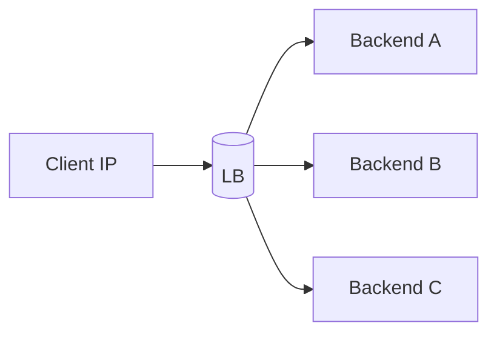

# IP Hash

## 0) Metadata
- **Name**: IP Hash
- **Canonical Path**: Patterns/008_LoadBalancingPatterns/IP_Hash.md
- **Category**: 008 Load Balancing Patterns
- **Status**: Stable
- **Last Updated**: YYYY-MM-DD
- **Tags**: load-balancing, affinity, sticky, hashing

---

## 1) TL;DR (Executive Summary)
- **Problem**: Need client affinity without server-side session storage.
- **Solution (essence)**: Hash the client IP to pick a backend; same client maps consistently.

---

## 2) Architecture

---

## 3) Properties & Tradeoffs
| Aspect | Pros | Cons | Notes |
|---|---|---|---|
| Affinity | No cookies/session | Uneven under NAT/CDNs | Consider consistent hashing |
| Simplicity | Very simple | Rebalance on node changes | Use hash with virtual nodes |

---

## 4) Implementation Guide
- Use when simple stickiness is enough and user distribution is uniform.
- Prefer header/cookie affinity behind CDNs/proxies.

---

## 5) Pitfalls & Edge Cases
- NAT pools collapse many users to one IP; hotspot risk.

---

## 6) References
- NGINX/HAProxy IP hash docs.
