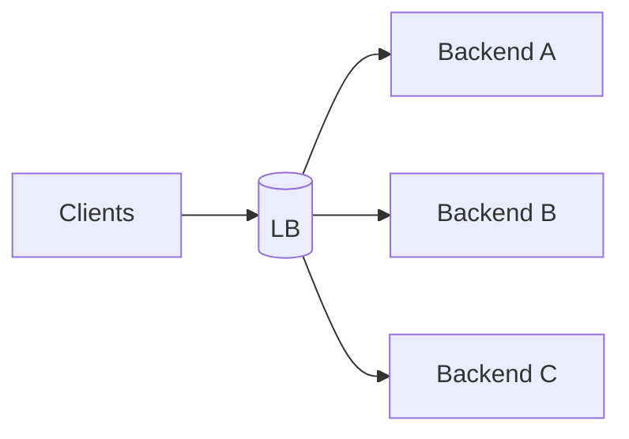

# Least Connections

## 0) Metadata
- **Name**: Least Connections
- **Canonical Path**: Patterns/008_LoadBalancingPatterns/Least_Connections.md
- **Category**: 008 Load Balancing Patterns
- **Status**: Stable
- **Last Updated**: YYYY-MM-DD
- **Tags**: load-balancing, least-connections, long-lived

---

## 1) TL;DR (Executive Summary)
- **Problem**: Round robin misallocates when connections vary in duration.
- **Solution (essence)**: Route new requests to the backend with the fewest active connections.

---

## 2) Architecture

---

## 3) Properties & Tradeoffs
| Aspect | Pros | Cons | Notes |
|---|---|---|---|
| Balance | Good for uneven durations | Needs state | Track active conns |
| Complexity | Low-moderate | Slight overhead | Scales well |

---

## 4) Implementation Guide
- Use for long-lived connections (WebSockets, gRPC streams).
- Combine with slow-start to avoid overloading new nodes.

---

## 5) Pitfalls & Edge Cases
- Sticky sessions may skew; ensure proper stickiness strategy.

---

## 6) References
- HAProxy/NGINX configs; service mesh docs.
