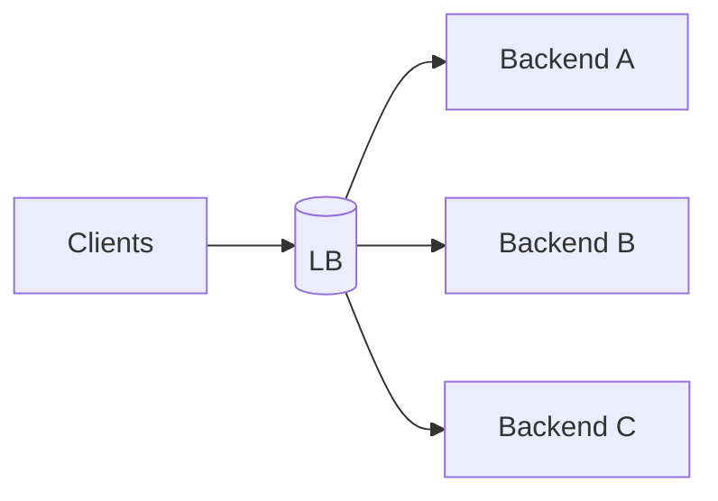

# Round Robin

## 0) Metadata
- **Name**: Round Robin
- **Canonical Path**: Patterns/008_LoadBalancingPatterns/Round_Robin.md
- **Category**: 008 Load Balancing Patterns
- **Status**: Stable
- **Last Updated**: YYYY-MM-DD
- **Tags**: load-balancing, round-robin, weighted

---

## 1) TL;DR (Executive Summary)
- **Problem**: Distribute requests evenly across backends without load measurements.
- **Solution (essence)**: Cycle through backends in order; optionally weight by capacity.

---

## 2) Architecture

---

## 3) Properties & Tradeoffs
| Aspect | Pros | Cons | Notes |
|---|---|---|---|
| Simplicity | Very simple | Ignores connection length | Good for short requests |
| Evenness | Fair (stateless) | Sensitive to heterogeneous nodes | Add weights |

---

## 4) Implementation Guide
- Use weighted round robin for different capacities.
- Combine with health checks; remove unhealthy nodes from rotation.

---

## 5) Pitfalls & Edge Cases
- Long-lived connections cause imbalance; prefer least-connections for such workloads.

---

## 6) References
- LB docs: NGINX/HAProxy/Envoy.
