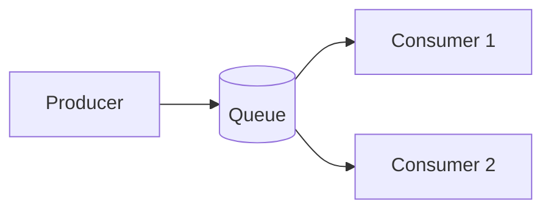

# Point-to-Point (Queues)

## 0) Metadata
- **Name**: Point-to-Point
- **Canonical Path**: Patterns/009_MessagingPatterns/Point_To_Point.md
- **Category**: 009 Messaging Patterns
- **Status**: Stable
- **Last Updated**: YYYY-MM-DD
- **Tags**: p2p, queues, work-queues, acks

---

## 1) TL;DR (Executive Summary)
- **Problem**: Need to distribute tasks among workers with reliable processing.
- **Solution (essence)**: Producers send messages to queues; consumers pull and ack; messages delivered to one consumer.

---

## 2) Architecture

---

## 3) Properties & Tradeoffs
| Aspect | Pros | Cons | Notes |
|---|---|---|---|
| Reliability | Acks/redelivery | Exactly-once hard | Idempotent handlers |
| Scale | Horizontal consumers | Queue hotspots | Partition queues |

---

## 4) Implementation Guide
- Prefetch/QoS; DLQs for poison messages; retries with backoff.
- Idempotency keys; dedupe at consumer.

---

## 5) Pitfalls & Edge Cases
- Message reordering; accept eventual ordering or use per-key queues.

---

## 6) References
- RabbitMQ work queues; SQS; JMS.
