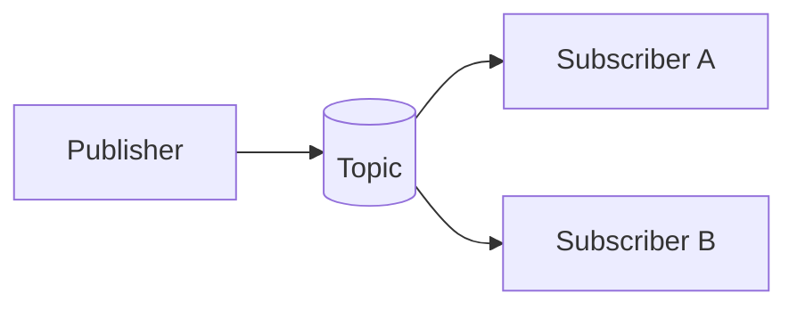

# Publish-Subscribe

## 0) Metadata
- **Name**: Publish-Subscribe
- **Canonical Path**: Patterns/009_MessagingPatterns/Publish_Subscribe.md
- **Category**: 009 Messaging Patterns
- **Status**: Stable
- **Last Updated**: YYYY-MM-DD
- **Tags**: pubsub, topics, subscriptions, fanout

---

## 1) TL;DR (Executive Summary)
- **Problem**: Need to fan out events to many consumers without tight coupling.
- **Solution (essence)**: Producers publish to topics; subscribers receive messages for topics they subscribe to.

---

## 2) Architecture

---

## 3) Properties & Tradeoffs
| Aspect | Pros | Cons | Notes |
|---|---|---|---|
| Decoupling | High | Delivery semantics vary | At-least/Exactly-once configs |
| Scale | Multiple consumers | Ordering per partition | Partitions/keys |

---

## 4) Implementation Guide
- Durable subscriptions or consumer groups; handle replays.
- Schema registry; compatibility; versioning.

---

## 5) Pitfalls & Edge Cases
- Duplicate deliveries; idempotent consumers.
- Backpressure on slow subscribers; DLQs.

---

## 6) References
- Kafka/RabbitMQ pub-sub docs; Cloud Pub/Sub.
