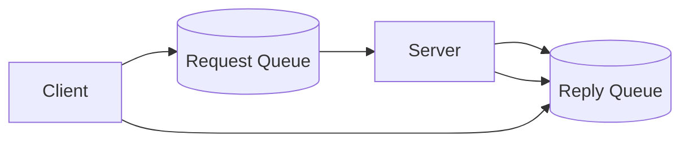

# Request-Response (RPC over Messaging)

## 0) Metadata
- **Name**: Request-Response
- **Canonical Path**: Patterns/009_MessagingPatterns/Request_Response.md
- **Category**: 009 Messaging Patterns
- **Status**: Stable
- **Last Updated**: YYYY-MM-DD
- **Tags**: rpc, correlation-id, reply-to, timeouts

---

## 1) TL;DR (Executive Summary)
- **Problem**: Need synchronous semantics over async messaging.
- **Solution (essence)**: Client sends a request message with correlation ID and reply-to; server replies on reply-to.

---

## 2) Architecture

---

## 3) Properties & Tradeoffs
| Aspect | Pros | Cons | Notes |
|---|---|---|---|
| Integration | Works over MQ | More moving parts | Timeouts required |
| Reliability | Durable queues | Complexity | Correlation & dedupe |

---

## 4) Implementation Guide
- Correlation IDs; `reply-to` headers; per-client or shared reply queues.
- Timeouts and retries; idempotent handlers; DLQs.

---

## 5) Pitfalls & Edge Cases
- Orphan replies; cleanup reply queues; TTLs.

---

## 6) References
- AMQP RPC patterns; JMS request-reply; SQS/SNS.
