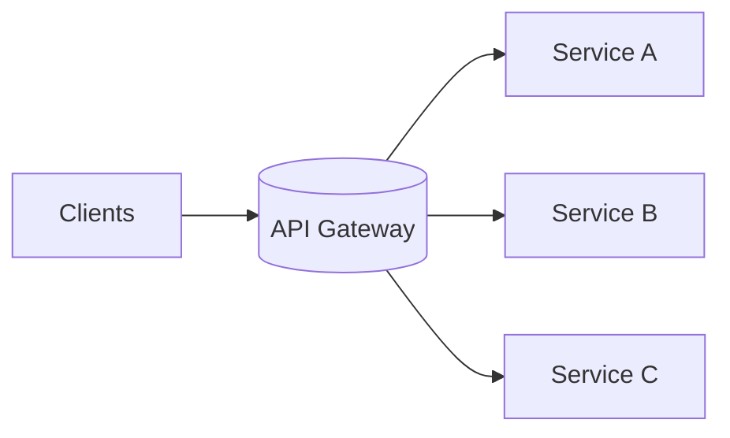

# API Gateway

## 0) Metadata
- **Name**: API Gateway
- **Canonical Path**: Patterns/010_MicroservicesPatterns/API_Gateway.md
- **Category**: 010 Microservices Patterns
- **Status**: Stable
- **Last Updated**: YYYY-MM-DD
- **Tags**: gateway, routing, auth, rate-limit, aggregation

---

## 1) TL;DR (Executive Summary)
- **Problem**: Clients shouldn’t manage many services, auth, and cross-cutting concerns.
- **Solution (essence)**: A gateway handles routing, authn/z, rate limits, aggregation, and observability.

---

## 2) Architecture

---

## 3) Properties & Tradeoffs
| Aspect | Pros | Cons | Notes |
|---|---|---|---|
| Simplicity | Single entry | Chokepoint risk | Scale HA, multi-AZ |
| Security | Central authz | Misconfig risk | Policy as code |
| Perf | Caching/agg | Extra hop | Use keep-alives, HTTP/2 |

---

## 4) Implementation Guide
- Functions: routing, JWT/OAuth, rate limiting, schema validation, transformation.
- Aggregation for coarse-grained endpoints; avoid heavy business logic.
- Blue/green rollout and canary routing.

---

## 5) Pitfalls & Edge Cases
- Overgrowth into ESB; keep thin. Avoid tight coupling.

---

## 6) Observability
- Metrics: per-route latency/error, 429s, auth failures.
- Tracing: propagate correlation IDs.

---

## 7) References
- Kong, Apigee, Envoy Gateway, AWS API Gateway.
