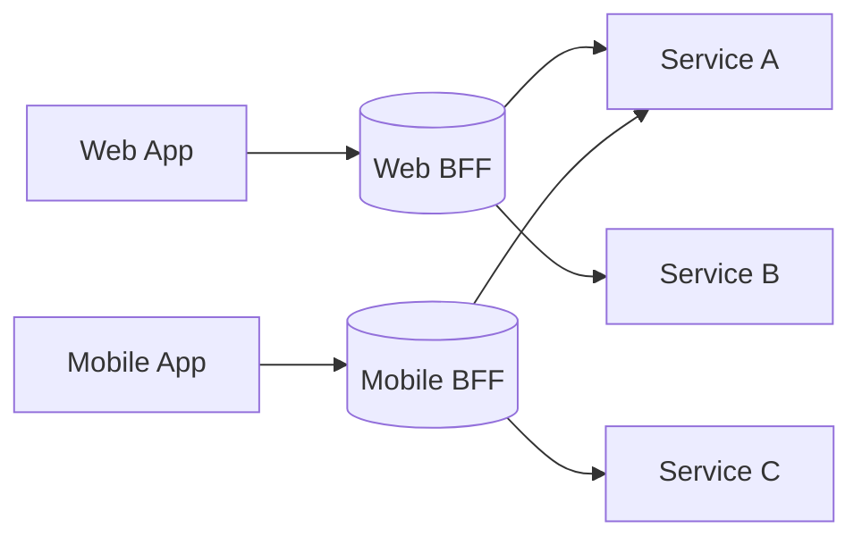

# Backend for Frontend (BFF)

## 0) Metadata
- **Name**: Backend for Frontend
- **Canonical Path**: Patterns/010_MicroservicesPatterns/Backend_For_Frontend.md
- **Category**: 010 Microservices Patterns
- **Status**: Stable
- **Last Updated**: YYYY-MM-DD
- **Tags**: bff, aggregation, ui-specific, composition

---

## 1) TL;DR (Executive Summary)
- **Problem**: Different clients (web/mobile) need tailored APIs; aggregation at gateway becomes messy.
- **Solution (essence)**: Provide a client-specific backend that composes/aggregates service calls for that client.

---

## 2) Architecture

---

## 3) Properties & Tradeoffs
| Aspect | Pros | Cons | Notes |
|---|---|---|---|
| UX Fit | Tailored endpoints | Dup logic across BFFs | Share libs where possible |
| Performance | Fewer round-trips | Extra hop | Co-locate with clients |
| Ownership | Clear | More services | Platform support |

---

## 4) Implementation Guide
- Keep business logic in domain services; BFFs compose/transform.
- Align deployment cadence with client release cycles.
- Reuse schema/domain types; version carefully.

---

## 5) Pitfalls & Edge Cases
- BFFs turning into monoliths; keep scope strict.

---

## 6) References
- BFF pattern (SoundCloud), API composition articles.
