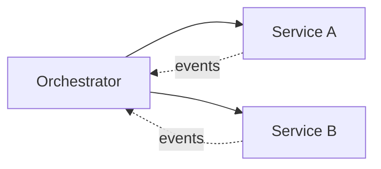

# Saga Pattern

## 0) Metadata
- **Name**: Saga Pattern
- **Canonical Path**: Patterns/010_MicroservicesPatterns/Saga_Pattern.md
- **Category**: 010 Microservices Patterns
- **Status**: Stable
- **Last Updated**: YYYY-MM-DD
- **Tags**: saga, orchestration, choreography, compensation

---

## 1) TL;DR (Executive Summary)
- **Problem**: Distributed transactions across services are hard/impractical.
- **Solution (essence)**: Sequence local transactions with compensating actions on failure (orchestrated or choreographed).

---

## 2) Approaches
- Orchestration: central coordinator issues commands.
- Choreography: services react to events.

## 3) Architecture

---

## 4) Properties & Tradeoffs
| Aspect | Pros | Cons | Notes |
|---|---|---|---|
| Consistency | Eventually consistent | Compensation logic | Idempotency needed |
| Coupling | Loose (choreo) | Hidden coupling via events | Docs & contracts |

---

## 5) Implementation Guide
- Define steps and compensations; store saga state.
- Outbox/inbox patterns; retries with backoff; dedupe.
- Timeouts and dead-letter handling.

---

## 6) Observability
- Trace IDs across steps; metrics on compensation rates.

---

## 7) References
- Saga pattern (Garcia-Molina), microservices patterns.
