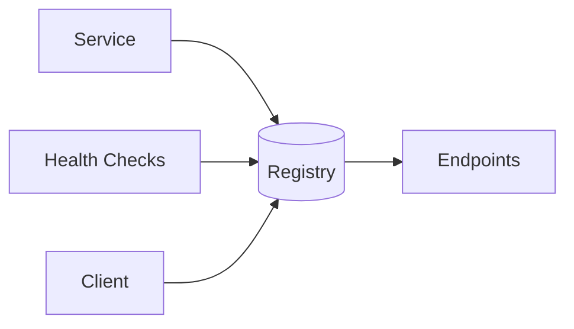

# Service Discovery

## 0) Metadata
- **Name**: Service Discovery
- **Canonical Path**: Patterns/010_MicroservicesPatterns/Service_Discovery.md
- **Category**: 010 Microservices Patterns
- **Status**: Stable
- **Last Updated**: YYYY-MM-DD
- **Tags**: discovery, registry, dns, service-mesh

---

## 1) TL;DR (Executive Summary)
- **Problem**: Clients need to find healthy service instances dynamically.
- **Solution (essence)**: Use a registry (or DNS) to resolve service names to healthy endpoints, updated by health checks.

---

## 2) Approaches
- Client-side (smart client) vs server-side (LB/proxy) discovery.
- Registries: Consul, etcd, Eureka; DNS SRV; service meshes (Envoy/Istio).

## 3) Architecture

---

## 4) Properties & Tradeoffs
| Aspect | Pros | Cons | Notes |
|---|---|---|---|
| Freshness | Real-time updates | Churn | TTLs, backoff |
| Simplicity | DNS-based easy | Stale under TTL | Short TTL + cache |

---

## 5) Implementation Guide
- Register/deregister on start/stop; heartbeat.
- Health checks; outlier detection; retries with jitter.

---

## 6) Observability
- Metrics: registry health, registration TTLs, lookup latency, failure rates.

---

## 7) References
- Consul/etcd/Eureka docs; service mesh literature.
