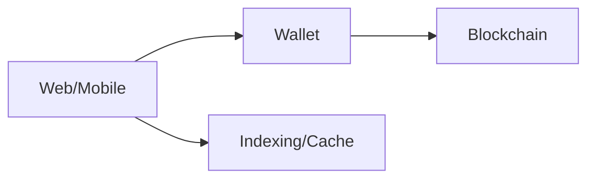

# Decentralized Applications (dApps)

## 0) Metadata
- **Name**: Decentralized Applications
- **Canonical Path**: Patterns/013_AdvancedTopics/Blockchain/Decentralized_Applications.md
- **Category**: 013 Advanced Topics / Blockchain
- **Status**: Stable
- **Last Updated**: YYYY-MM-DD
- **Tags**: dapp, wallet, web3, contracts

---

## 1) TL;DR (Executive Summary)
- Apps that interact with smart contracts and wallets; design for UX, security, and cost.

---

## 2) Architecture

---

## 3) Implementation Guide
- Wallet integration; signing; gas estimation; indexing (The Graph).
- Security: phishing, approvals, key storage.

---

## 4) References
- Web3 libraries; wallet provider docs; indexing services.
