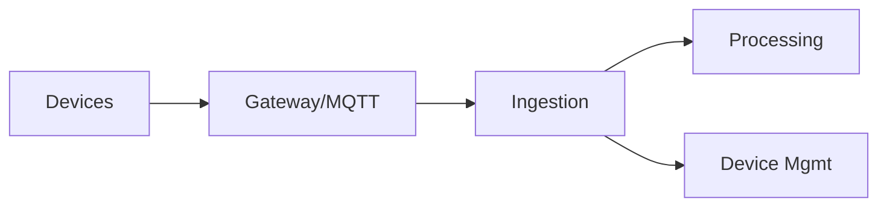

# IoT Architectures

## 0) Metadata
- **Name**: IoT Architectures
- **Canonical Path**: Patterns/013_AdvancedTopics/EdgeComputing/IoT_Architectures.md
- **Category**: 013 Advanced Topics / Edge Computing
- **Status**: Stable
- **Last Updated**: YYYY-MM-DD
- **Tags**: iot, mqtt, device-management, telemetry

---

## 1) TL;DR (Executive Summary)
- Securely connect, manage, and process telemetry from devices at scale with edge gateways and cloud services.

---

## 2) Architecture

---

## 3) Implementation Guide
- Provisioning; certificates; OTA updates; device shadow.
- Protocols: MQTT/CoAP; offline buffering; QoS.

---

## 4) References
- AWS IoT/Azure IoT docs; MQTT specs.
