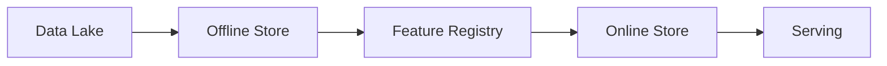

# Feature Stores

## 0) Metadata
- **Name**: Feature Stores
- **Canonical Path**: Patterns/013_AdvancedTopics/MachineLearning/Feature_Stores.md
- **Category**: 013 Advanced Topics / Machine Learning
- **Status**: Stable
- **Last Updated**: YYYY-MM-DD
- **Tags**: features, offline/online, consistency, freshness

---

## 1) TL;DR (Executive Summary)
- Centralize feature definitions and storage with offline/online consistency for training/serving.

---

## 2) Architecture

---

## 3) Properties & Tradeoffs
- Consistency between offline and online; freshness vs cost.

## 4) Implementation Guide
- Single source of truth for features; materialize to online with SLAs.
- Backfills and replays; version features.

---

## 5) References
- Feast, Tecton docs; feature store papers.
