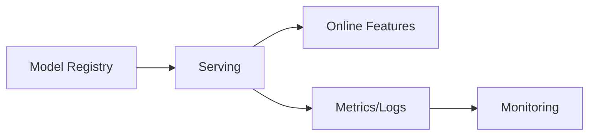

# Model Serving

## 0) Metadata
- **Name**: Model Serving
- **Canonical Path**: Patterns/013_AdvancedTopics/MachineLearning/Model_Serving.md
- **Category**: 013 Advanced Topics / Machine Learning
- **Status**: Stable
- **Last Updated**: YYYY-MM-DD
- **Tags**: serving, inference, canary, drift, GPUs

---

## 1) TL;DR (Executive Summary)
- Serve models with low latency and high availability; manage versions and rollouts with monitoring.

---

## 2) Architecture

---

## 3) Implementation Guide
- Batch vs online inference; autoscaling; hardware (CPU/GPU).
- Canary deploys; A/B testing; shadow traffic; rollback.
- Monitor accuracy proxies, latency, error rate, drift.

---

## 4) References
- KFServing/Seldon; TF Serving; model serving platforms.
