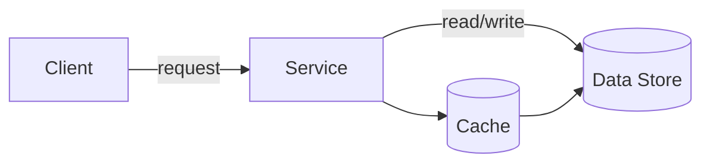
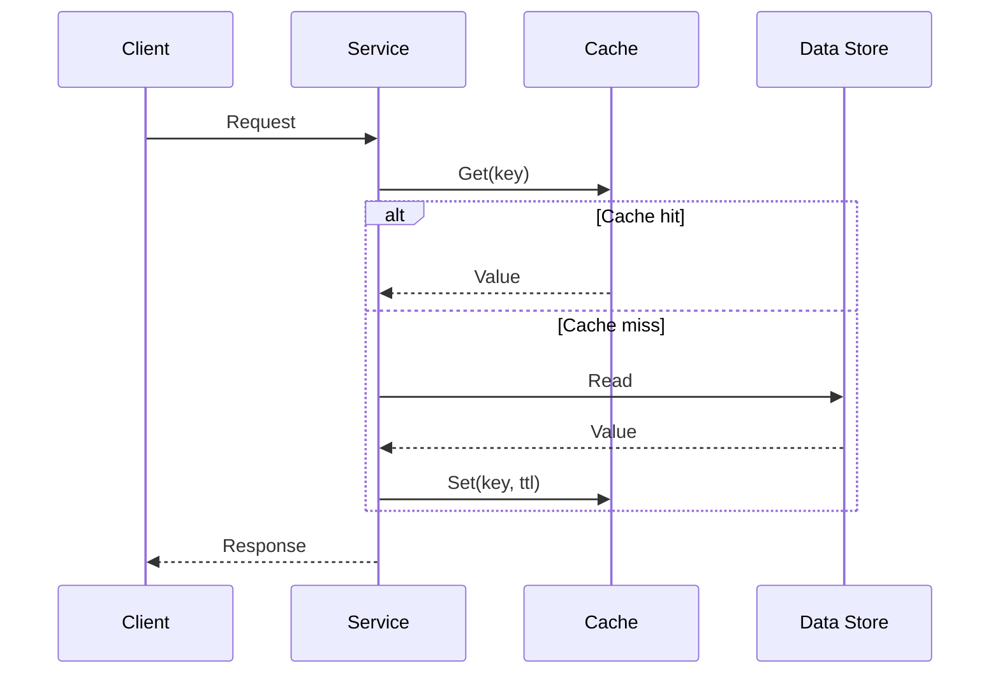

# System Design Pattern Guide

## 0) Metadata
- **Name**: [Pattern Name]
- **Canonical Path**: Patterns/00x_Category/Subcategory/Pattern_Name.md
- **Category**: [001 Fundamentals | 002 Core Components | 003 Distributed Systems | 004 Architectural Patterns | 005 Resilience Patterns | 006 Scalability Patterns | 007 Database Patterns | 008 Load Balancing Patterns | 009 Messaging Patterns | 010 Microservices Patterns | 011 Performance | 012 Security | 013 Advanced Topics]
- **Status**: Draft | Stable | Deprecated
- **Last Updated**: YYYY-MM-DD
- **Owners**: [Team/Person]
- **Reviewers**: [Teams/SMEs]
- **Tags**: [e.g., caching, consistency, multi-region]

---

## 1) TL;DR (Executive Summary)
- **Problem**: [One line describing the core pain]
- **Solution (essence)**: [One line capturing the key idea]
- **Use when**: [Key triggers/conditions]
- **Avoid when**: [Simpler/cheaper alternatives fit]
- **Key tradeoff**: [e.g., availability vs consistency]

---

## 2) Problem & Context
- **Problem Statement**: What specifically are we solving?
- **Context**: Domain, workload shape, traffic patterns, data characteristics.
- **Business Impact**: Latency, availability, correctness, cost, time-to-market.
- **Non-goals**: What this pattern does NOT try to solve.

## 3) Decision Drivers
- **SLOs/SLA**: Latency targets (p50/p95/p99), availability, durability.
- **Scale**: QPS, concurrent sessions, data volume, growth rate.
- **Constraints**: Regulatory/compliance, platform limits, legacy dependencies.
- **Cost**: Budget ceilings (compute, storage, egress), operational headcount.

---

## 4) Intuition & Baseline
- **Naive approach**: How would we solve this without the pattern?
- **Why it fails**: Bottlenecks, hotspots, consistency gaps, cost blowups.
- **Key insight**: The mental model that unlocks the solution.

---

## 5) The Pattern (Optimized Approach)
- **Core Concept**: [2–4 bullets in plain English]
- **Happy-path flow (high level)**:
  1. [Step]
  2. [Step]
  3. [Step]
- **Degraded/Failure mode**: Timeouts, retries, fallbacks, partial results.

---

## 6) Architecture
### 6.1 Flow Diagram


### 6.2 Sequence (Optional)


### 6.3 Components
- Services, data stores, queues, caches, gateways, external providers.
- Trust boundaries and network zones.

---

## 7) Interfaces
### 7.1 API Contracts (if applicable)
```
POST /resource
{ ... }

200 OK { ... }
4xx { error, message }
5xx { error, traceId }
```
- **Idempotency**: [keys/headers]
- **Pagination/Filtering**: [if relevant]
- **SLAs**: [latency/availability]

### 7.2 Events & Schemas (if applicable)
- Topic names, event formats, ordering/duplication guarantees.

---

## 8) Data Model & Storage
- **Entities/relationships**
- **Indexes & access patterns**
- **Partitioning/sharding keys**
- **Retention & TTLs**
- **Backups & restore points**

---

## 9) Properties & Guarantees
- **Scalability**: Horizontal/vertical; known scaling bottlenecks.
- **Availability (CAP posture)**: CP or AP, failover expectations.
- **Consistency**: Strong | Eventual | Causal; read-your-writes?
- **Latency**: Typical p50/p95/p99 under load; tail mitigation.
- **Throughput**: Sustained and burst capacity.
- **Fault Tolerance**: Blast radius, graceful degradation.
- **Complexity**: Build/operate complexity, cognitive load.

---

## 10) Tradeoffs
| Aspect | Pros | Cons | Notes |
|---|---|---|---|
| Performance |  |  |  |
| Scalability |  |  |  |
| Availability |  |  |  |
| Consistency |  |  |  |
| Cost |  |  |  |
| Complexity |  |  |  |
| Maintainability |  |  |  |
| Operability |  |  |  |
| Security |  |  |  |

---

## 11) Implementation Guide
- **Preconditions & Dependencies**: Existing systems, SLAs, third-party limits.
- **Services/Components**: What to build/configure.
- **Infrastructure**: Regions, zones, instances, autoscaling, networking.
- **Configuration Defaults**: Sensible starting values (timeouts, retries, TTLs, pool sizes).
- **Code Example (minimal)**:
```python
# Pseudocode or minimal example
# Emphasize timeouts, retries, and idempotency where relevant
```

---

## 12) Common Pitfalls & Edge Cases
- Hot keys/skewed traffic; caching stampede; thundering herd.
- Retry storms, non-idempotent operations, duplicate deliveries.
- Clock skew, TTL expiry, token/session invalidation.
- Partial failures, compensation/sagas, lost updates.
- Multi-tenant isolation, noisy neighbors, quota enforcement.

### Edge-case Checklist
- Cold start behavior and warm-up strategy
- Backpressure and overload control (shed, queue, degrade)
- Idempotency keys and deduplication
- Consistency on failover/partition healing
- Schema/version mismatches
- Regional outage and failback procedures

---

## 13) Resilience & Recovery
- **Failure Modes**: Likely failures and blast radius.
- **Degradation**: Read-only mode, stale reads, feature flags.
- **Recovery**: Restart order, replays, rebuilds, backfills.

---

## 14) Observability
- **Key Metrics (with targets)**:
  - Latency p50/p95/p99, error rate, saturation, queue depth, cache hit ratio.
- **Example SLOs**: p99 ≤ [X] ms; availability ≥ [Y]%; error rate ≤ [Z]‰.
- **Alerts**:
  - Page: p99 latency > 1.2×SLO for 10m AND error_rate > 2×baseline
  - Ticket: cache_hit_ratio < [HIT%] for 30m
- **Tracing/Logging**: Correlation IDs, structured logs, sampling.

---

## 15) Capacity & Sizing
- **Back-of-the-envelope**:
  - QPS × payload × replication = network/storage throughput
  - Working set ≈ hot keys × value size × TTL window
- **Headroom**: 30–50% for bursts; autoscaling triggers.

---

## 16) Security & Compliance
- **Authn/z**: Who can do what; scopes/roles.
- **Data protection**: In transit, at rest; key management.
- **Tenant isolation**: Resource limits, noisy neighbor mitigation.
- **Compliance**: PII handling, deletion/retention, audit trails.
- **Threats**: Injection, replay, poisoning; mitigations and rate limits.

---

## 17) Deployment, Versioning & Migration
- **Rollout**: Blue/green, canary, feature flags.
- **Versioning**: API, event, and schema compatibility.
- **Migrations**: Dual writes/reads, backfills, cutover plans, rollbacks.

---

## 18) Testing & Verification
- **Tests**: Unit, integration, load, soak, chaos/fault injection.
- **DR Drills**: Region failover, data restore, replay correctness.
- **Success criteria**: SLOs met; error budgets respected; no data loss.

---

## 19) Cost Model
- **Drivers**: Compute, storage, egress, managed services.
- **Levers**: Caching TTLs, compression, batching, instance class, autoscaling.
- **Budgets**: Monthly cost targets; guardrails and alerts.

---

## 20) Runbooks
- Common operational procedures and on-call actions:
  - Elevated errors
  - Latency spikes
  - Cache stampede
  - Queue backlog
  - Regional degradation/outage

---

## 21) Variants, Alternatives & Related Patterns
- **Variants**: [List with brief differences]
- **Alternatives**: When to choose X instead of this pattern.
- **Often combined with**: Complementary patterns.

---

## 22) Practice Scenarios
- Small: [Design a rate limiter/cache for endpoint X with constraints Y]
- Medium: [Scale feature Z from 10 QPS to 5k QPS with SLOs]
- Large: [Multi-region rollout with failover and consistency constraints]
- Validate: SLOs, failure handling, capacity, cost.

---

## 23) Real-world Examples
- Production use cases and links (if public)
- How the approach evolved with scale

---

## 24) References
- Books, papers, tech blogs, docs, talks.

---

## 25) Completion Checklist
- [ ] Problem, drivers, non-goals captured
- [ ] Intuition + baseline vs optimized approach documented
- [ ] Architecture diagrams (flow + optional sequence)
- [ ] Interfaces, data model, and properties defined
- [ ] Tradeoffs and capacity math included
- [ ] Resilience, observability, security covered
- [ ] Deployment, migration, testing plans present
- [ ] Cost model and runbooks written
- [ ] Variants/alternatives and references added 